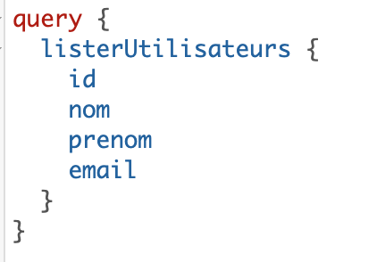

# Version

- **1.0.0-SNAPSHOT** : initialisation du projet

# Objectif

Service d'intéraction communiquant avec le serveur de resource bancaire.

# Technique

Nécéssite une connection oauth2 et d'un jeton JWT pour fonctionner :
https://github.com/langston8182/bank-oauth2-authorization-server

Necéssite de lancer le serveur de resources pour fonctionner :
https://github.com/langston8182/service-utilisateur

Il faut avant tout démarrer le serveur d'autorisation et le serveur de resources.

Port d'écoute : 8200

**Postman** :
Se loguer pour récupérer le token JWT

# GraphQL

Utilise le langage de requêtage graphQL pour envoyer des requêtes REST.
http://localhost:8100/graphiql

\

# Docker

Utiliser docker-compose pour lancer le serveur.
`docker-compose up`

# Maven

Pour compiler le projet et créer l'image docker exécuter :
\
`mvn package`

Pour push l'image sur dockerHug, exécuter:
\
`mvn dockerfile:push`

# Contributeur

Cyril Marchive (cyril.marchive@gmail.com)
